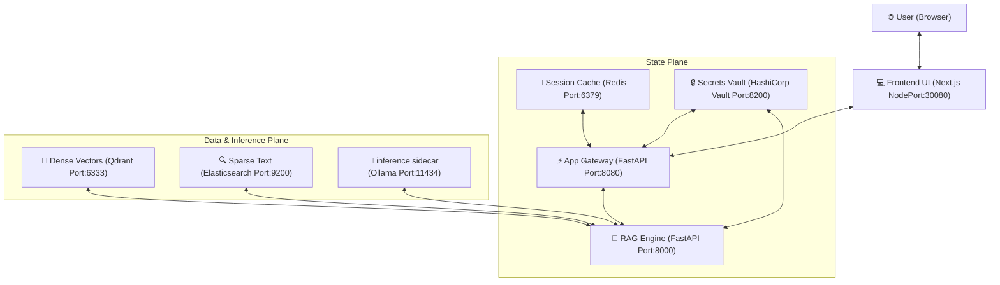

# Enterprise LLMOps Platform: Local Production-Grade Infrastructure

An enterprise-grade, local-first **LLMOps Platform** that decouples heavy machine learning runtimes from stateless application pipelines, providing a secure, resilient, and highly observable environment for local LLM orchestration.

This platform integrates two distinct developer assets:
1. **Secure Chatbot Infrastructure:** Adapted Next.js frontend, SonarQube SAST, Trivy scanning, and Jenkins CI/CD.
2. **Reasoning RAG Engine:** Multi-path query decomposition, local vector/sparse retrieval, and self-consistency decoding.

---

## 🏗️ Platform Architecture

The platform architecture completely separates the compute plane from the state and data planes, preventing memory exhaustion (OOM) failures under heavy load:



---

## 🚀 Key Features

* **Stateless Compute Isolation:** The RAG engine and App Gateway contain zero model weights or database binaries, keeping the RAM footprint minimal (~200MB - ~1GB for classifier pipelines) and resolving Kubernetes OOM container evictions.
* **Dual-Engine Hybrid Retrieval:** Combines dense vectors (Qdrant with Cosine similarity) and sparse indexing (Elasticsearch with BM25) fused via Reciprocal Rank Fusion (RRF) and reranked using a Cross-Encoder with StackOverflow preference weightings.
* **Ollama Inference Sidecar:** Quantized GGUF models (`gemma2:2b`) are offloaded to a dedicated sidecar container running on CPU in Kubernetes, creating clean microservice boundaries.
* **Secrets Management:** Sensitive environment variables (Redis passwords, API urls) are fetched at runtime from a **HashiCorp Vault dev server** deployed inside the cluster.
* **Ansible Orchestration:** Deployment manifests are completely templated and applied using Ansible playbooks, replacing rigid manifests with dynamic, environment-aware templating.
* **CI/CD Security Gates:** A declarative Jenkinsfile builds images, runs static application security testing (SAST via SonarQube), performs filesystem and container image scans (Trivy), and executes Ansible playbooks.

---

## 🛠️ Quickstart (Local Minikube Deployment)

Ensure you have Minikube, Helm, and Ansible installed on your Mac.

### 1. Start Minikube with resources
```bash
minikube start --cpus=6 --memory=12288 --disk-size=20g
```

### 2. Run Ingestion Scripts
Upload StackExchange processed Q&A dataset to Qdrant and Elasticsearch:
```bash
# Set local development environment URLs
export QDRANT_URL="http://$(minikube ip):30033"
export ELASTICSEARCH_URL="http://$(minikube ip):30092"

python3 training/ingestion/index_to_qdrant.py
python3 training/ingestion/index_to_elasticsearch.py
```

### 3. Deploy Stack using Ansible
```bash
ansible-playbook -i ansible/inventory.ini ansible/playbooks/deploy.yml
```

### 4. Access the UI
Find the Minikube IP and open it on port `30080`:
```bash
open http://$(minikube ip):30080
```

---

## 💬 Interview talking points

* **Why Decouple the LLM?** Placing model serving inside the RAG pod causes massive Docker image sizes and makes pod scheduling nearly impossible. Moving the LLM to Ollama creates an independent deployment lifecycle and lets K8s scale RAG logic separate from heavy TPU/GPU/CPU inference.
* **How are secrets protected?** Standard Kubernetes secrets store tokens in base64 (not secure). The App Gateway queries HashiCorp Vault at boot over a secure internal service port. If Vault is uncontactable, it fails to start, ensuring zero credentials leak in configurations.
* **Why hybrid retrieval?** Dense search excels at semantic concepts but fails on exact keyword syntax (e.g. `list.reverse()`). Sparse search (BM25) guarantees exact matching. Fusing them with RRF (k=60) offers the best of both worlds.
* **How does Ansible improve Kubernetes pipelines?** Instead of maintaining complex Kustomize configs and duplicating manifests for local, staging, and production environments, Ansible playbooks render templates using standard Jinja2 syntax and execute deployments in a unified control loop.
