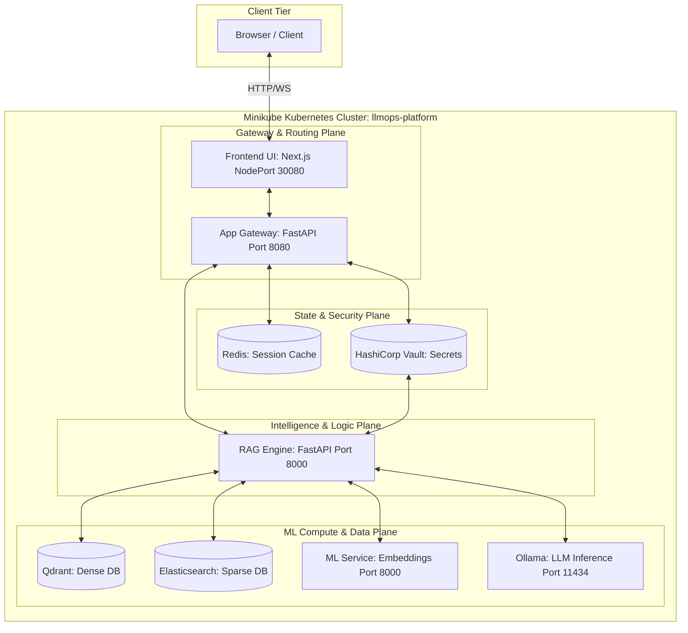
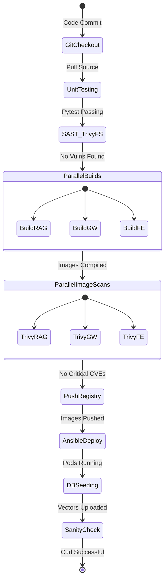
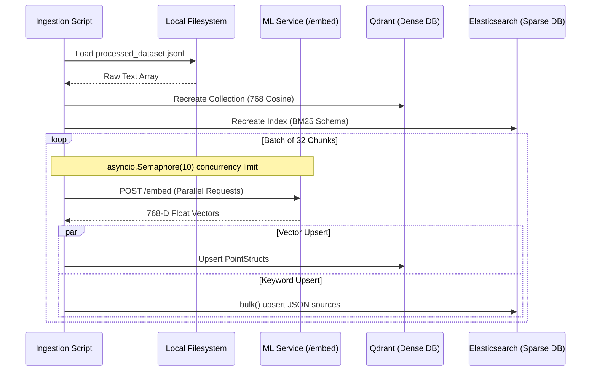
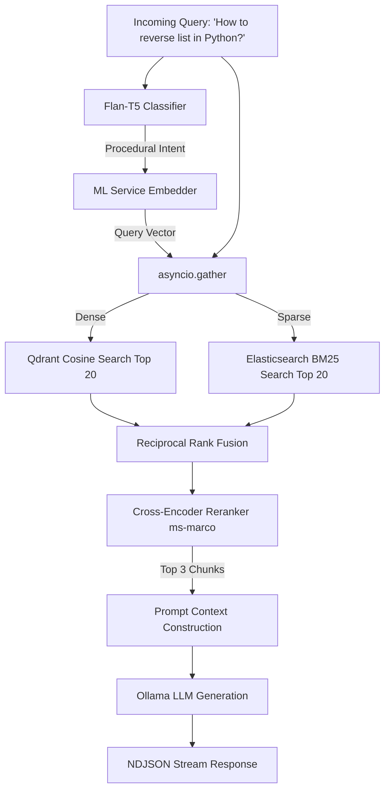
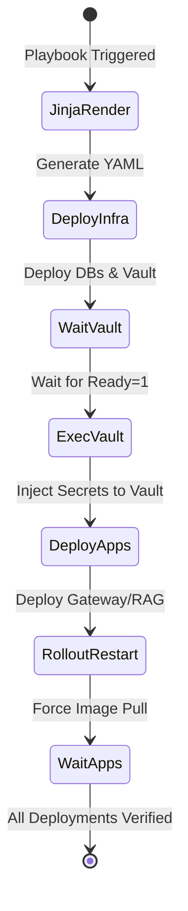

# Enterprise LLMOps Platform: Master Architecture Document

## 1. Executive Summary
This document provides the definitive, master architectural blueprint for the Enterprise LLMOps Platform. The platform establishes a local, production-grade Kubernetes ecosystem that completely isolates compute-heavy Machine Learning (ML) workloads from stateful session management and stateless routing logic. 

---

## 2. Platform Architecture Topology

The entire system resides within a Minikube cluster but simulates an enterprise-grade cloud deployment, splitting concerns across four dedicated planes.

### 2.1 Plane Isolation Strategy (Why this architecture?)
- **Gateway & Routing Plane:** Contains no ML logic. If traffic spikes, scaling the `Frontend` or `App Gateway` is near instantaneous (sub-second startup).
- **State & Security Plane:** `Vault` keeps static credentials entirely out of the container image layers. `Redis` guarantees that if an App Gateway pod dies during a chat, the session history is instantly recovered by the new pod.
- **Logic Plane:** The RAG Engine orchestrates but does not execute the heavy ML models. It's essentially a fast orchestration router.
- **ML Compute Plane:** `Ollama` and `ML Service` consume 90% of the hardware footprint. By isolating them, we prevent them from starving the web servers of RAM, avoiding Kubernetes OOM (Out-Of-Memory) Evictions.

---

## 3. The Continuous Integration / Continuous Delivery (CI/CD) Workflow

We utilize a robust declarative Jenkins pipeline that strictly enforces security and reliability before any code touches the cluster.

### 3.1 Pipeline Deep-Dive
1. **Unit Testing (`pytest`):** A transient python `venv` is spun up to mock endpoints and execute business logic tests for both the Gateway and RAG engine.
2. **Trivy Filesystem Scan:** Analyzes the raw source code (like `requirements.txt` or `package.json`) to halt the pipeline if vulnerable packages exist.
3. **Parallel Image Builds:** By building the Docker images for `rag-engine`, `app-gateway`, and `frontend` concurrently using Jenkins `parallel` blocks, pipeline runtime is slashed by ~65%.
4. **Trivy Image Scan:** Inspects the compiled OS layers of the docker images. Flags any `HIGH` or `CRITICAL` vulnerabilities.
5. **Database Seeding via Port-Forwarding:** 
   - The Jenkins agent executes background `kubectl port-forward` processes (`&`).
   - It runs the `run_ingestion.py` script.
   - It forcefully kills (`kill $PID`) the port-forwards upon completion.
6. **Sanity Verification:** The pipeline validates success not just by looking at Kubernetes pod status, but by actually forwarding port `8080`, firing a POST request with `curl`, and verifying the JSON response parses correctly.

---

## 4. Asynchronous Data Ingestion Flow

The `run_ingestion.py` script dictates how knowledge is injected into the dual-database system.

### 4.1 Ingestion Concurrency and Fallback Mechanisms
- **Async Semaphore Limiting:** If 10,000 documents are ingested sequentially, it takes hours. If ingested in parallel without limits, it DOS'es the ML-service. The `asyncio.Semaphore(10)` ensures exactly 10 concurrent requests map to `/embed` at any given millisecond, optimizing throughput while protecting hardware.
- **Dual-Schema Validation:**
  - **Qdrant** is strictly rebuilt with `VectorParams(size=768, distance=Distance.COSINE)`.
  - **Elasticsearch** mappings explicitly tag `chunk_text` with `"similarity": "BM25"` to override default TF-IDF algorithms and utilize the BM25 probabilistic relevance framework.

---

## 5. RAG Engine Execution & Retrieval Flow

The intelligence of the system relies on parallel retrieval and mathematical fusion.

### 5.1 Deep Algorithmic Flow
1. **Intent Classification:** The local `google/flan-t5-base` model acts as a fast router. Depending on the question intent, it modifies the prompt injection template.
2. **Hybrid Parallel Search:**
   - Both databases are searched simultaneously via `asyncio.gather`. 
   - **Qdrant** executes a mathematical vector cosine proximity calculation. (Captures semantics).
   - **Elasticsearch** executes an inverted index keyword hit query. (Captures exact syntax).
3. **Reciprocal Rank Fusion (RRF):** 
   - Standard semantic scores (e.g., `0.87`) and BM25 scores (e.g., `14.2`) are fundamentally incompatible and cannot be added.
   - RRF ignores absolute scores and uses rankings: `RRF_Score = 1 / (60 + Ranking_Position)`. This safely unifies both result sets.
4. **Cross-Encoder Reranking:**
   - The fused top candidates are passed through `cross-encoder/ms-marco-MiniLM-L-6-v2`.
   - The cross-encoder is heavily augmented to boost documents containing high StackOverflow scores and `is_accepted: true` flags, floating premium engineering answers to the top.

---

## 6. Ansible Orchestration & Kubernetes Lifecycle

The deployment relies on declarative Ansible templates to manage Kubernetes state dynamically.

### 6.1 Idempotency and Deployment Nuances
- **Jinja2 Templating:** Instead of rigid manifests, Ansible compiles `.yaml.j2` templates at runtime, dynamically injecting the Jenkins `{{ image_tag }}` and `{{ docker_registry }}`.
- **Synchronized State Waiters:** Ansible utilizes `kubernetes.core.k8s_info` inside `until` blocks with a `delay: 5` to actively poll the K8s API until `status.readyReplicas` matches the desired spec.
- **Vault CLI Invocation:** Uses `kubernetes.core.k8s_exec` to run `vault kv put` from *inside* the pod. This eliminates the need for exposing the Vault API to the host machine.
- **Combating ImagePullBackOff & Cache Staling:** Minikube aggressively caches images. Even with `imagePullPolicy: Always` in the template, if the deployment YAML hash doesn't change, K8s won't cycle the pod. Ansible solves this by forcefully issuing `kubectl rollout restart deployment/...` guaranteeing the newest compiled binaries run.
