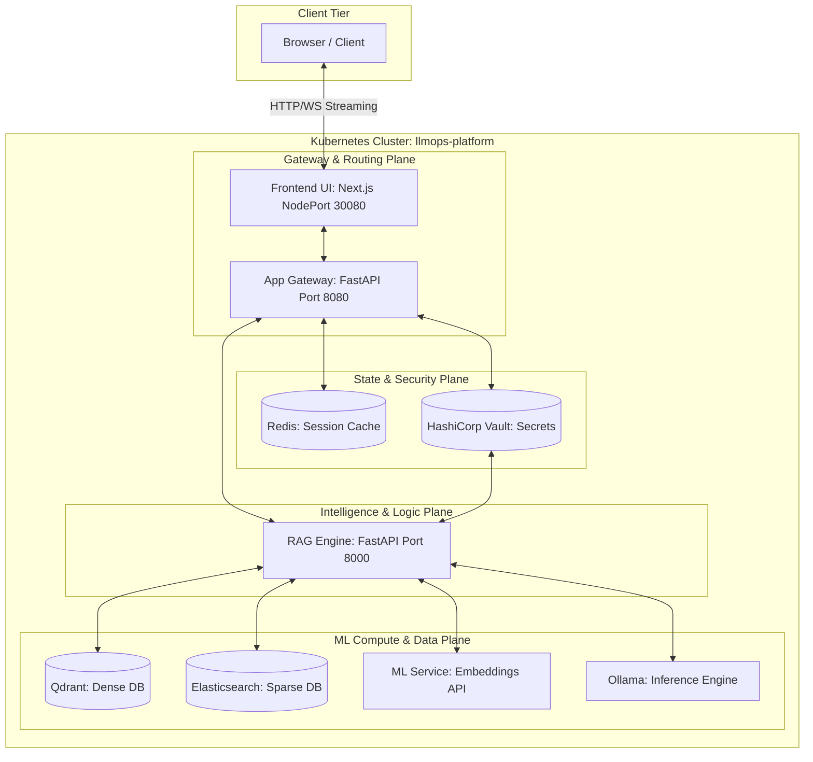
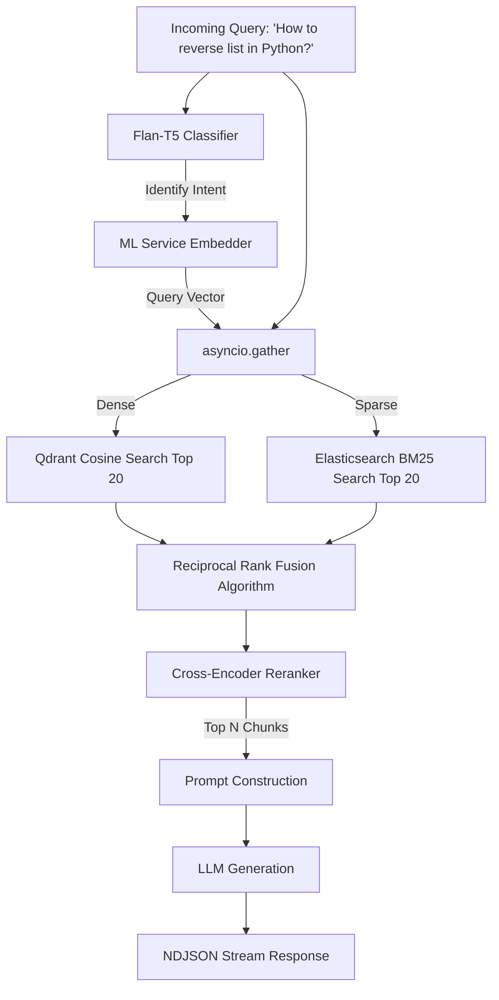
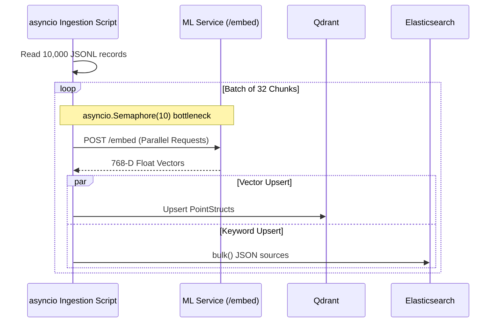
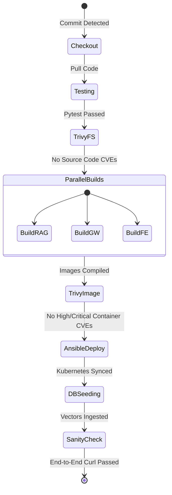

# SDE Technical Engineering Report: Enterprise LLMOps Platform

**Project Repository:** [ChatBot_MLOps](https://github.com/poojann-pandyaa/ChatBot)

## 1. Executive Summary & Problem Statement

Building and orchestrating Large Language Models (LLMs) locally presents significant resource management challenges. A monolithic architecture inevitably leads to CPU starvation, memory leaks, and Kubernetes Out-of-Memory (OOM) pod evictions when subjected to concurrent queries and heavy embedding tasks. 

**The Solution:** This project introduces an enterprise-grade LLMOps platform designed around **Stateless Compute Isolation**. By decoupling the heavy machine learning runtimes (inference and vector embeddings) from the application pipelines (state management, API routing, and frontend streams), the system ensures high availability, resilient session caching, and deterministic CI/CD deployments.

---

## 2. Project Phases & Engineering Lifecycle

The development of this platform was structured into four core engineering phases:

1. **Phase 1: Component Decoupling & Local Inference.** The initial architecture involved stripping the LLM model weights out of the core Python API. By delegating inference to an isolated `Ollama` sidecar container running `gemma2:2b`, the API memory footprint dropped from several gigabytes to ~200MB, stabilizing the baseline routing.
2. **Phase 2: Hybrid Search & Concurrency.** Building the RAG engine required solving the limitations of purely semantic search. An asynchronous ingestion pipeline was engineered to seed data into both Qdrant (dense vectors) and Elasticsearch (sparse keywords) simultaneously, unified at runtime via Reciprocal Rank Fusion (RRF).
3. **Phase 3: CI/CD Automation & Security.** A robust Jenkins pipeline was developed. Rather than just building images, strict quality gates were introduced: `pytest` suites, `Trivy` filesystem/container CVE scanning, and automated `curl`-based end-to-end sanity verification.
4. **Phase 4: Declarative Infrastructure Orchestration.** Migrating away from fragile shell scripts, the entire Kubernetes infrastructure was templated using `Ansible` and `Jinja2`, providing idempotency, dynamic variable injection, and automated rollout restorations.

---

## 3. Architectural Layers & Network Topology

The system resides within a local Kubernetes cluster (Minikube), simulating a multi-node enterprise environment through isolated planes.

### 3.1 Engineering Reasoning for Plane Isolation
- **Gateway Plane:** Acts as the stateless ingress point. Scaling the FastAPI and Next.js pods is sub-second because they carry no heavy model weights.
- **State Plane:** Kubernetes ephemeral containers wipe data on restart. Extracting session memory into Redis PersistentVolumeClaims (PVCs) ensures chat context survives pod evictions. Vault ensures zero static secrets exist in the Docker layer cache.
- **Logic Plane:** The RAG engine acts as the orchestration brain, classifying queries and fusing search results without executing the raw tensor mathematics itself.
- **ML Compute Plane:** By boxing Ollama and the ML Embedding service, K8s resource quotas can be strictly applied. If Ollama spikes to 100% CPU, the Gateway and Redis remain fully responsive.

---

## 4. Subsystem Deep Dives

### 4.1 RAG Engine & Hybrid Retrieval Algorithm
Pure semantic search struggles with specific syntax (e.g., `list.reverse()`), while pure keyword search lacks contextual understanding. To solve this, a parallel Hybrid Search architecture was engineered.

**Engineering Challenge & Solution:**
Scores from Qdrant (`0.87`) and Elasticsearch (`14.2`) are mathematically incompatible. The implementation utilizes the **Reciprocal Rank Fusion (RRF)** algorithm (`score = 1 / (60 + rank)`) to normalize and merge the arrays securely. The fused array is then passed through a local `ms-marco` Cross-Encoder, heavily augmented to boost documents possessing high developer upvotes, yielding premium context injection.

### 4.2 High-Concurrency Data Ingestion
Populating vector databases sequentially is too slow, but unbounded parallel requests crash the embedding API.

**Engineering Challenge & Solution:**
To optimize throughput without inducing a Denial of Service (DOS) on the local ML-Service, the Python ingestion script (`run_ingestion.py`) implements an `asyncio.Semaphore(10)`. This strict bottleneck guarantees exactly 10 concurrent requests at any given millisecond. 

---

## 5. CI/CD & Infrastructure Orchestration

The platform prioritizes automated, deterministic rollouts via Jenkins and Ansible.

### 5.1 Declarative Infrastructure (Ansible over Shell)
Instead of executing raw `kubectl apply` commands on static YAML, the pipeline triggers an Ansible role (`k8s_deploy`).
- **Jinja2 Templating:** Injects runtime variables (`{{ image_tag }}`) dynamically into K8s manifests.
- **Synchronized Readiness Probes:** Ansible utilizes `k8s_info` inside `until` blocks with a `delay: 5` to actively poll the K8s API until dependencies (like HashiCorp Vault) report `status.readyReplicas == 1` before deploying the microservices.
- **Bypassing Kubernetes Caching:** Local environments aggressively cache images. To guarantee the newest Jenkins-compiled binary executes, the playbook explicitly forces a `kubectl rollout restart deployment/X` on target pods.

---

## 6. Key Takeaways & Architectural Impact
By treating local development with enterprise-grade rigor, this project demonstrates strong capabilities in:
1. **Systems Design:** Architecting resilient microservice boundaries that prevent resource starvation.
2. **Algorithms:** Implementing complex asynchronous I/O and mathematical fusion (RRF) for advanced NLP tasks.
3. **DevSecOps:** Building secure, self-healing, and fully automated deployment pipelines from the ground up.
