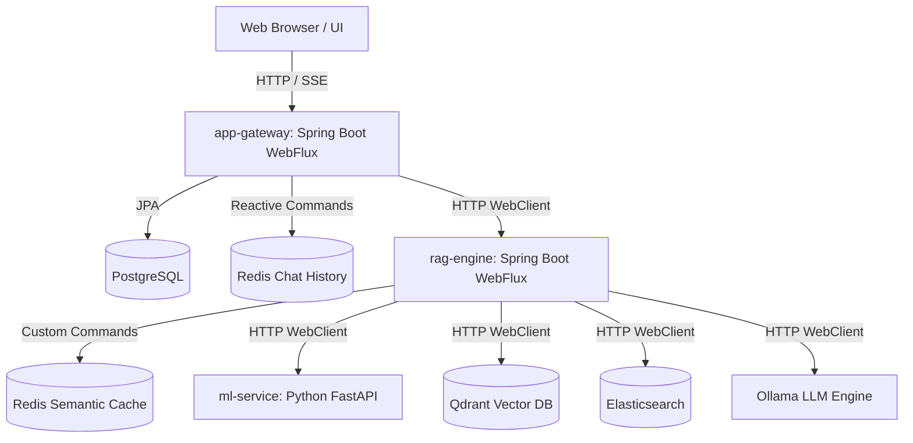

# System Architecture — LLMOps Chatbot Platform

This document describes the polyglot microservice architecture of the LLMOps Chatbot Platform, detailing components, data flows, caching strategies, and resilience configurations.

## Architecture Diagram

## System Components

### 1. Frontend
- **Technology**: Next.js
- **Responsibility**: Provides the chat user interface. Communicates with `app-gateway` for sending chat prompts and retrieving historical conversations.

### 2. App Gateway (`services/app-gateway`)
- **Technology**: Java 21, Spring Boot WebFlux (Reactive)
- **Database**: PostgreSQL (for durable session metadata), Redis (for session messages/history)
- **Key Features**:
  - Exposes `/api/chat` supporting streaming (NDJSON) and non-streaming responses.
  - Manages conversation state and history logs.
  - Automatically loads the last 10 messages for prompt context.
  - Acts as a proxy to the `rag-engine` service.

### 3. RAG Engine (`services/rag-engine`)
- **Technology**: Java 21, Spring Boot WebFlux (Stateless)
- **Database**: Redis (used for Semantic Search Cache)
- **Key Features**:
  - Orchestrates reasoning path routing based on ML-driven classifications.
  - Performs **hybrid retrieval** (dense vector search in Qdrant combined with sparse keyword search in Elasticsearch), using **Reciprocal Rank Fusion (RRF)** for combined relevance scoring.
  - Applies a quality gate to filter out low-relevance retrieval results.
  - Integrates query refinement and self-consistency generation.

### 4. ML Service (`services/ml-service`)
- **Technology**: Python, FastAPI, PyTorch
- **Responsibility**: Serves local neural models for feature extraction:
  - **Classifier**: `google/flan-t5-base`
  - **Embedder**: `BAAI/bge-base-en-v1.5`
  - **Reranker**: `cross-encoder/ms-marco-MiniLM-L-6-v2`

### 5. Ollama LLM Engine
- **Responsibility**: Hosts the generator model (`gemma2:2b`) for local response generation.

---

## Data flow & Cache Strategies

### Conversation Logs (Durable State)
- Stored as Redis lists under the key pattern: `chat:{conversation_id}`.
- Durable metadata (conversation ID, title, and creation timestamp) is persisted in a **PostgreSQL** relational database.

### Semantic Cache
- A Redis Search (`redis-stack-server`) index named `idx:semantic_cache` caches prompt/response pairs based on KNN vector search.
- If a new prompt's cosine distance to a cached query is within the threshold (e.g. `0.05` for commonsense queries), the cache hits, bypassing downstream classification, retrieval, and generation steps.

---

## Resilience Configurations

All downstream HTTP endpoints are protected using **Resilience4j** annotations:
- **Retries**: Enabled on inter-service WebClient calls with exponential backoff.
- **Circuit Breaker**: Implemented to fail-fast if downstream services suffer persistent outages.
- **Fallbacks**: Configured on failure conditions (e.g., local keyword heuristics when the classifier is down; mock messages when Ollama is offline) to maintain service availability.
