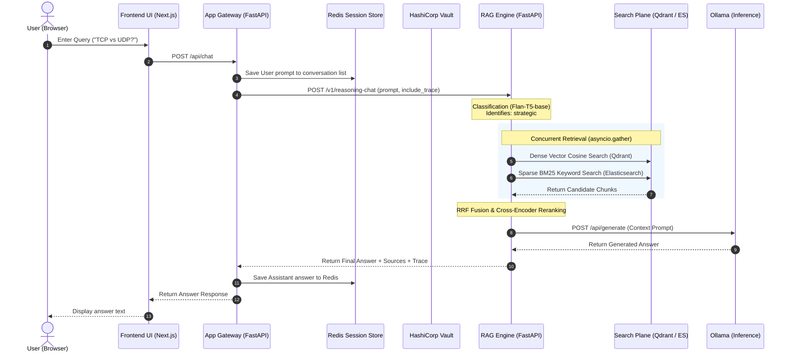

# System Architecture Documentation

This document describes the technical architecture, component interactions, data flows, and monitoring metrics of the integrated Enterprise LLMOps Platform.

---

## 🏛️ System Components

### 1. Frontend UI (Next.js)
Adapted from the Chatbot UI fork, the frontend exposes a NodePort service on port `30080`. It allows users to chat with the system and retrieve response text in real time. It communicates with the local Next.js Edge runtime, which proxies queries directly to the App Gateway.

### 2. App Gateway (FastAPI)
The central ingress controller of the backend plane, running on port `8080`.
* **State Caching:** Logs prompts and answers to a Redis database using list operations (`LPUSH`, `LRANGE`) to keep a persistent local history of conversations.
* **Vault Configurator:** Communicates with HashiCorp Vault dev server at boot using the `hvac` client to read environment configurations and DB credentials.
* **Stateless Routing:** Coordinates requests to the RAG Engine and wraps them in clean JSON payloads.

### 3. Reasoning RAG Engine (FastAPI)
The core intelligence engine, running on port `8000`. It contains three execution layers:
* **Query Classification:** Utilizes a lightweight local `google/flan-t5-base` model to categorize incoming questions into three reasoning pathways: Commonsense (direct retrieval), Adaptive (multi-part questions), and Strategic (comparative choices).
* **Parallel Hybrid Retrieval:** Executes dense search (Qdrant client) and sparse search (Elasticsearch BM25 client) concurrently using `asyncio.gather` for the query and its decomposed sub-questions. Fuses top candidates using Reciprocal Rank Fusion (RRF).
* **Cross-Encoder Reranker:** Runs candidates through `cross-encoder/ms-marco-MiniLM-L-6-v2` and incorporates StackOverflow upvotes and accepted answer weights to float the most premium engineering content to the top.

### 4. HashiCorp Vault (Dev Server)
Deployed inside the cluster as `vault` on port `8200`. It mounts a kv-v2 engine at `secret/` and stores database passwords and endpoint URLs, ensuring zero static credentials exist in our container builds.

### 5. Redis Session Store
A fast session cache exposed on port `6379`, securing user histories and maintaining state across client reloads.

### 6. Ollama Inference Sidecar
A container running on CPU that hosts the quantized model (`gemma2:2b`). It exposes an API on port `11434` for generating completions based on the context prompts built by the RAG Engine.

---

## 🔄 Sequence Flow of a Query

---

## 📊 Observability & Metrics

The platform exposes custom Prometheus metrics for scraping by monitoring agents.

### RAG Engine Metrics (Exposed on `/metrics` at port `8000`):
* `rag_request_latency_seconds`: Histogram measuring end-to-end response time.
* `rag_classification_latency_seconds`: Histogram measuring T5 query classifier speed.
* `rag_retrieval_latency_seconds`: Histogram measuring parallel Qdrant/ES queries.
* `rag_generation_latency_seconds`: Histogram measuring Ollama generation speed.
* `rag_requests_total`: Counter tracking successful and failed requests.

### App Gateway Metrics (Exposed on `/metrics` at port `8080`):
* `gateway_request_latency_seconds`: Histogram measuring gateway proxy times.
* `gateway_requests_total`: Counter tracking total ingress traffic.
