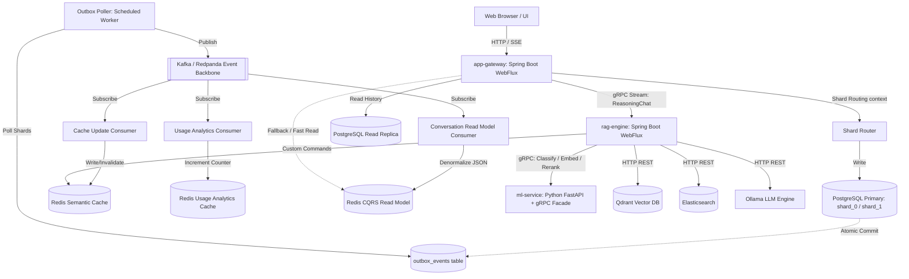

# System Architecture — LLMOps Chatbot Platform

This document describes the modern polyglot microservice architecture of the LLMOps Chatbot Platform, detailing components, data flows, caching strategies, and resilience configurations.

---

## 1. Architecture Diagram

---

## 2. System Components

### 2.1 Frontend
- **Technology**: Next.js
- **Responsibility**: Provides the chat user interface. Communicates with `app-gateway` for sending chat prompts and retrieving historical conversations.

### 2.2 App Gateway (`services/app-gateway`)
- **Technology**: Java 25, Spring Boot WebFlux (Reactive)
- **Database**: PostgreSQL (sharded by `user_id` hash on the primary, with replica routing), Redis (caching denormalized read model and session logs).
- **Key Features**:
  - Exposes `/api/chat` supporting streaming (NDJSON) and non-streaming responses.
  - Manages conversation state and history logs.
  - Implements **Transactional Outbox** pattern to commit conversation edits and schedule events atomically.
  - Implements **CQRS read path** fetching directly from Redis summaries, separating writes from read-heavy requests.
  - Dynamically routes database requests across logical shards (`shard_0`, `shard_1`) using thread-local route keys.

### 2.3 RAG Engine (`services/rag-engine`)
- **Technology**: Java 25, Spring Boot WebFlux (Stateless)
- **Database**: Redis (used for Semantic Search Cache)
- **Key Features**:
  - Exposes a server-streaming gRPC service (`ReasoningChat`) for gateway calls.
  - Orchestrates reasoning path routing based on ML-driven classifications.
  - Performs **hybrid retrieval** (dense vector search in Qdrant combined with sparse keyword search in Elasticsearch), using **Reciprocal Rank Fusion (RRF)** for combined relevance scoring.
  - Applies a quality gate to filter out low-relevance retrieval results.
  - Integrates query refinement and self-consistency generation.

### 2.4 ML Service (`services/ml-service`)
- **Technology**: Python 3.11, FastAPI + gRPC server facade thread, PyTorch
- **Responsibility**: Serves local neural models for feature extraction:
  - **Classifier**: `google/flan-t5-base`
  - **Embedder**: `BAAI/bge-base-en-v1.5`
  - **Reranker**: `cross-encoder/ms-marco-MiniLM-L-6-v2`
  - Runs a concurrent gRPC thread facade on port `50051` to serve internal client requests efficiently.

### 2.5 Ollama LLM Engine
- **Responsibility**: Hosts the generator model (`gemma2:2b`) for local response generation.

---

## 3. Distributed Patterns & Caching

### 3.1 gRPC Migration
All internal network communication has been transitioned from REST/HTTP to strongly-typed **gRPC** protocols, reducing serialization latency and establishing strict API contracts:
- `app-gateway` ↔ `rag-engine`: Server-streaming tokens.
- `rag-engine` ↔ `ml-service`: Classify, embed, and rerank requests.

### 3.2 Transactional Outbox & Event Backbone
To prevent dual-write drift (failing to publish an event to Kafka after committing to the database), `app-gateway` writes to the `conversations` table and inserts an event in the `outbox_events` table in a single local transaction.
A background `OutboxPoller` polls unpublished events and publishes them to **Redpanda (Kafka)**.

### 3.3 CQRS (Command Query Responsibility Segregation)
- **Command Path (Writes)**: `ConversationCommandService` validates prompts, inserts to databases, and writes to the Outbox.
- **Query Path (Reads)**: `/api/history/{id}` endpoint reads denormalized summaries directly from Redis under the key `conversation:{id}:summary`. The summary is compiled asynchronously by the `ConversationReadModelConsumer` listening to `chat-completed` Kafka events.

### 3.4 Database Sharding & Replicas
- The `conversations` database table is logically sharded into `shard_0` and `shard_1` schemas based on `hashCode(userId) % 2`.
- Read commands (queries) route to a replica database instance (or port fallback in dev), while write commands route to the primary.

---

## 4. Resilience Configurations

Inter-service client calls are protected using **Resilience4j** configurations:
- **Retries**: Configured with exponential backoff on all gRPC channels.
- **Circuit Breakers**: Transitions to open state to prevent cascading failures if a service is down.
- **Fallbacks**: Degrades gracefully on system outages (e.g. falling back to keyword heuristic classification or flagged offline response messages).
- **Kafka DLQ**: Consumer exceptions trigger message routing to a Dead Letter Topic (`chat-completed.DLT`) managed by a custom recovery handler.
